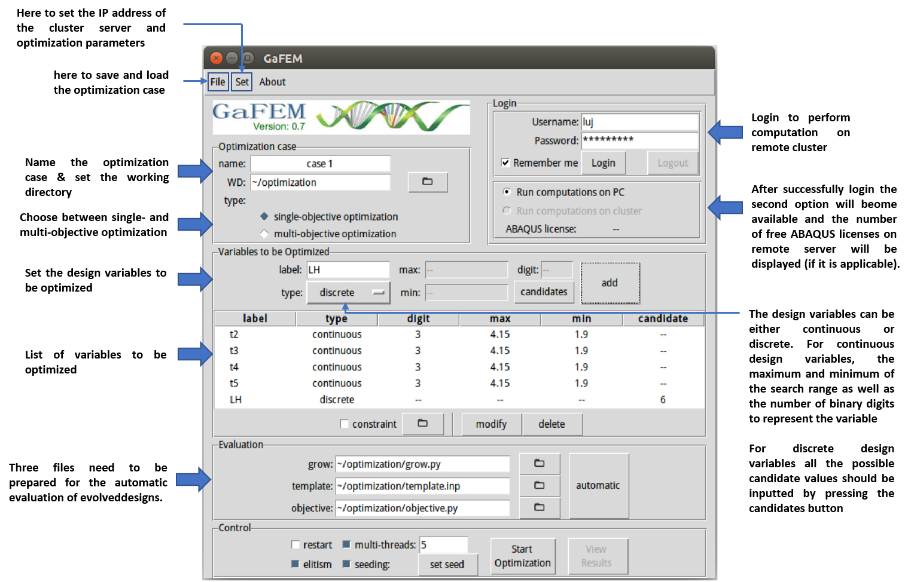
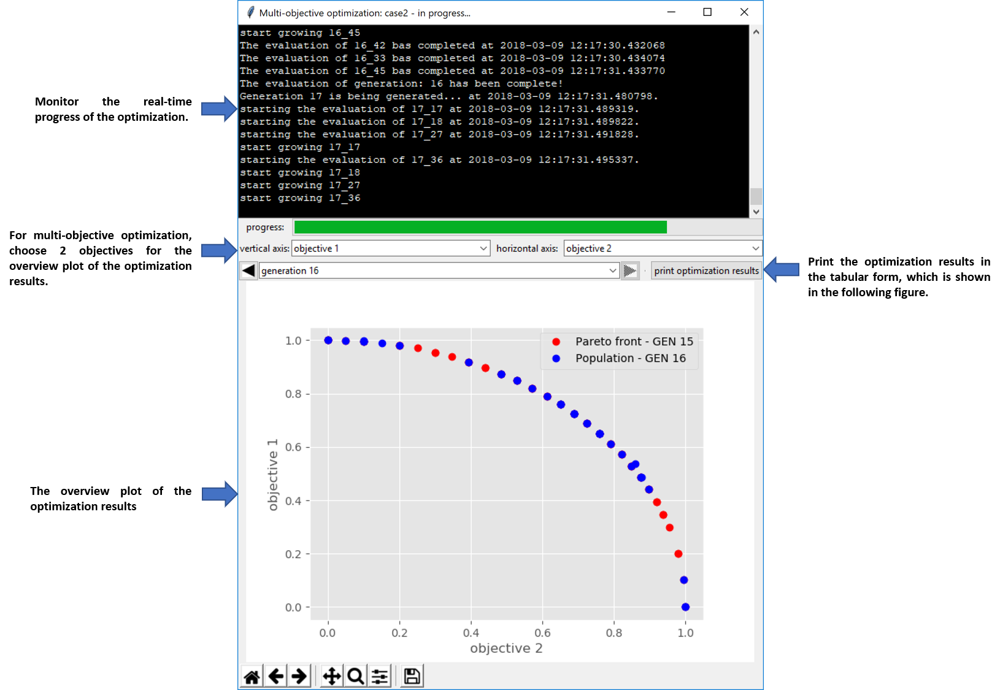
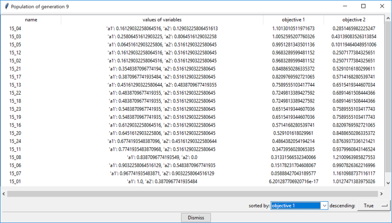

    
# GaFEM
GaFEM is a software, which initially aims at coupling genetic algorithm with FEM simulations for automated parameter optimization in the design processes. It is also suitable for many other optimization tasks, where the quality of a design can be evaluated by various computational approaches. 

## Features
 - The user can use the graphic user interface of GaFEM (see **Using the graphic user interface** section) to perform both single- and multi-objective optimizations. For single-objective optimization, the user will get the optimum or at least the sub-optimum designs with the highest fitness values. For multi-objective optimization, the user will get the so-called Pareto front, which is a set of designs that show the best compromise between conflicting design objectives. 
 - The user can choose to perform the computation either on the local computer or on a remote cluster.
 - In case of large optimization problems, parallelization of computation can be performed to accelerate the optimization process.
 - The user can save frequently applied optimization scenarios as .opt files for the convenience of repeated usage. 
 - When the optimization is interrupted unexpectedly, it is possible to resume the optimization process at the broken point.

## Getting started
1. Make sure python 3 is installed in the computer.
2. The following python libraries must be installed: tkinter, matplotlib, numpy, pandas, Pmw, paramiko, PIL, deap.
3. Copy all the files in this repository to your working directory.
4. Enter your working directory through a command prompt in Window system or a terminal in Linux system and type `python GAGUI.py` to start the software.

## Using the graphic user interface
1. The primary user interface

    
   
2. Monitoring the optimization process

    
   
3. Viewing the optimization results in tabular form

       
   
## Preparations for starting an optimization case
Three different types of files needed to be prepared for performing the optimization: grow, template and objective files as shown in the "Evaluation" section on the primary user interface.
1. grow file(s): at least one python script, which execute ghe FEM simulations. The script must be named as "grow.py", which should contain a function "grow" without a return statement. The function shuold receive 2 parameters: name and phenotype. The parameter name of the function is a automatically allocated string for each design evolved in the optimization, which is in the form of "\[index of generation\]_\[index of individual\]". For example the "00_00" will be assigned to the first individual in the first generation. This string will be associated with the names of automated generated input files for FEM simulations; the parameter phenotype is a dictionary with all the labels of design variables as keys and the values of the design variables as the corresponding values.
For complicated cases the script "grow.py" can also call other python scripts for running the simulations, all of which must be inputted either through the entry field with comma seperating different entries or through the multiple selection function by clicking the folder icon. 

2. template file(s): one or more files that contain all the instructions and design parameters for setting up the models of FEM simulations. The names of the design variables, which have be set in the "design variable" part of the GUI, should appear at the right positions of the template file. 

3. object file: a python script to define how to evaluate the evolved designs based on the simulation results, which return the value(s) of fitness against objective function(s) in a tuple. The script should be named as objective.py, which should contain a function "objective" in the following form, where the variables name and phenotype are defined in the same way as in the grow function mentioned above.

```
def objective(name, phenotype):

	. . .

	return (fitness_1, fitness_2, ..., fitness_n)	# return (fitness, ) for single objective optimization
```
To be continued

   
